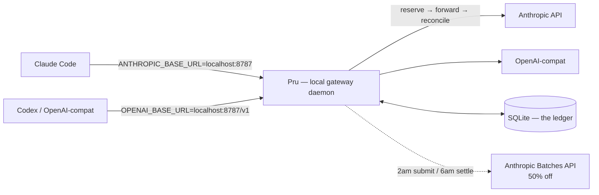
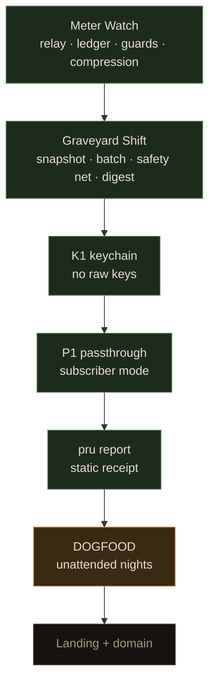

# Prudence (`pru`)

Pru cuts your agent bill. She sits underneath Claude Code and Codex,
watches every model call settle through her ledger, and closes the books
the moment a session overspends — loudly, with the exact next command.
Non-urgent work goes to the night window instead, where the same models
cost half price.

- **Meter Watch** — hard budget caps in the request path, per-minute
  pacing, circular-spending guard, noise trimmed before billing.
- **Graveyard Shift** — queue by day, run at 2am against the Batch API
  (50% off), wake to verified commits and a receipt queue.
- **The Ledger** — every call booked in SQLite: posted spend,
  reservations, typed refusals. One row of truth, rendered the same
  everywhere. Export it anytime with `pru report`.

Status: all core tracks built and live-tested against the real Anthropic
API (metered sessions, enforced caps, two night jobs landed). The
unattended overnight run and subscriber-mode hardening are in progress —
see "Roadmap" below.

## How it works



Each call is measured, priced inside its envelope, and reserved in one
SQLite transaction. The request forwards (SSE streams pass straight
through, never buffered); provider-reported usage reconciles the books.
Over budget, Pru answers 429 before anything forwards:

```text
Pru closed the ledger for this session ($5.00 spent).
Resume with: `pru budget set 10` — or relax the watch: `pru budget off`.
```

A refusal means STOP: report the row, ask your human. Hammering a
closed ledger trips the circular-spending guard. Retries cost $0.00 —
the storm burns patience, never money.

## Requirements

- **Bun** ([bun.sh](https://bun.sh)), **git**, macOS or Linux.
- An **API key** (`ANTHROPIC_API_KEY`) — *or* a Claude subscription with
  the daemon in passthrough mode (see "Subscribers").
- Night ticks (2am/6am) use launchd on macOS; elsewhere, run
  `pru graveyard --run` from cron.

## Install

```sh
git clone https://github.com/prudence-cli/prudence.git && cd prudence
./install.sh
```

That installs dependencies, links `~/.local/bin/pru` (add it to PATH if
prompted), points Claude Code at the daemon, allowlists the read-only
wallet commands, and syncs the slash packs. Then:

```sh
export ANTHROPIC_API_KEY="sk-ant-..."   # or: pru setup (macOS keychain, recommended)
pru start                                # daemon on localhost:8787 — keep this running
curl -s localhost:8787/health           # want "key_configured":true
pru demo                                 # the 60-second story, no keys, no spend
```

If Claude Code errors on every call, the daemon is down or keyless —
the health check tells you which. Escape hatch: remove the `"env"`
block from `~/.claude/settings.json` and traffic goes direct again.

## Meter Watch

```sh
pru budget set 5                                  # global USD cap (default unit)
pru budget set 2 --scope project --key ~/myrepo   # per-project
pru budget set 200 --unit calls                   # subscriber-style units: usd|tokens|calls
pru budget off                                    # relax (sessions still counted)
pru pace set 1            # max $1 per trailing minute (token-bucket: an empty window always admits one call)
pru pace off
pru compress on|off       # trim log/JSON noise before billing (default on, counted per call)
pru status                # sessions, spend, caps, refusals — the books
```

Caps evaluate per request straight from the ledger: arming, hitting,
and relaxing all take effect instantly, no restart. Re-arming moves the
limit only — posted spend never clears. Caps in `tokens`/`calls` enforce
without dollar prices; unpriced models fail closed under USD caps and
flow under unit caps.

Inside the harnesses: `/pru:status` (Claude Code slash pack) and the
Codex `AGENTS.md` engraving in `packs/` read the same daemon truth.
Pru meets you in your pane; the CLI stays a control plane.

## Graveyard Shift

Daytime queueing (free, instant, exact 50% math up front):

```sh
pru graveyard "migrate src/ to the new logger" --path ~/myrepo
pru graveyard                      # list the queue
```

Overnight execution (submit 2am, settle 6am, verified branches only):

```sh
pru graveyard --schedule --test-command "npm test --silent"   # install ticks (macOS)
pru graveyard --run --test-command "..."   # same path by hand, for daylight tests
pru graveyard --digest             # morning receipt queue (or /pru:nightshift)
pru tallies                        # what the nights set aside
pru graveyard --publish <id> --pr  # push the verified branch, open the PR
pru graveyard --retry <id>         # re-snapshot and requeue a failed job
```

How a night is judged: the diff must `git apply --check` against the
frozen snapshot, then your test command must pass on the night branch
without regressing base. Improvement or no-regression commits;
everything else stays an artifact with a written reason. Nothing lands
without proof — including proof-shaped placeholders. (`expect(true)`
suites are green-but-empty; review every PR like one.)

## Subscribers (no API key)

```sh
pru start --auth-mode passthrough
pru budget set 200 --unit calls
```

Pru forwards your harness credential verbatim — explicit opt-in only,
never stored, logged, or persisted (canary-tested). Enforcement moves
to calls/tokens; dollars read NULL honestly. Night batches still need
an API key (batches bill keys, not plans). Spec: `docs/subscription-passthrough.md`.

## Keys without fear

```sh
pru setup                 # seal a key in the macOS keychain (hidden prompt)
pru setup --forget        # remove it again
```

Resolution order: `PRU_UPSTREAM_API_KEY` → keychain → bare env. With no
keychain entries this reduces exactly to env behavior. The secret lives
in one OS-guarded place, read at boot; logs, DB, and error bodies never
contain it.

## Receipts and verification

```sh
pru report                          # single-file HTML receipt, no server
bun run check                       # tsc + full suite, mock upstreams only — never live APIs
```

Design contracts live in `docs/`: `relay-design.md`, `runcap-study.md`,
`coverage.md` (including the honest gaps), `subscription-passthrough.md`,
`report-spec.md`. `PROGRESS.md` is the living audit — every phase, every
live-fire lesson, every deviation, logged.

## Troubleshooting

| Symptom | Likely cause | Fix |
|---|---|---|
| Every call fails | Daemon down or keyless | `curl localhost:8787/health`; restart with key exported or sealed |
| `key_missing` 429 | No credential for the route | Export/seal a key (API) or use `--auth-mode passthrough` (plan) |
| 429 storm that resolves | Cap tripped + harness retries | Bounded, free; `pru status` shows the rows; raise or relax the cap |
| Night jobs stay `queued` | Lid slept through ticks | `pmset -g sched` for wakes; charger in; ticks need the machine awake |
| `conflict`/`failed` nights | Diff won't apply / tests red | Read `result.diff` + `report.md` in `~/.prudence/night/<id>/`; `--retry` after fixes |
| `bun: not found` in tick logs | Stale shim | Re-run `./install.sh` (bakes the absolute Bun path) |
| Spend "cleared" after `budget set` | It didn't — confirmation now reads the row back | `pru status` shows lifetime session spend |

## Roadmap



Done and live-tested: relay, ledger, guards, compression, installer,
night pipeline (submit → verify → commit → publish), tallies, digest,
report, keychain, passthrough, pricing v5. In progress: unattended
overnight validation, subscriber hardening, landing page. Deliberately
not building: hosted dashboards, team features, hybrid local routing,
any competing agent harness — Pru lives inside your tools, not beside
them.

## License

MIT. See `LICENSE`.
