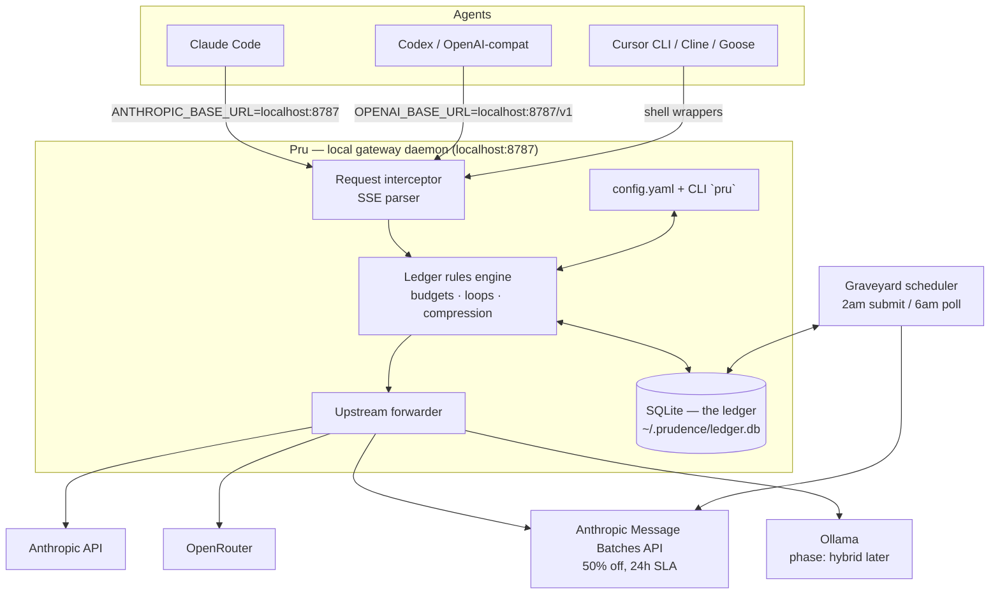
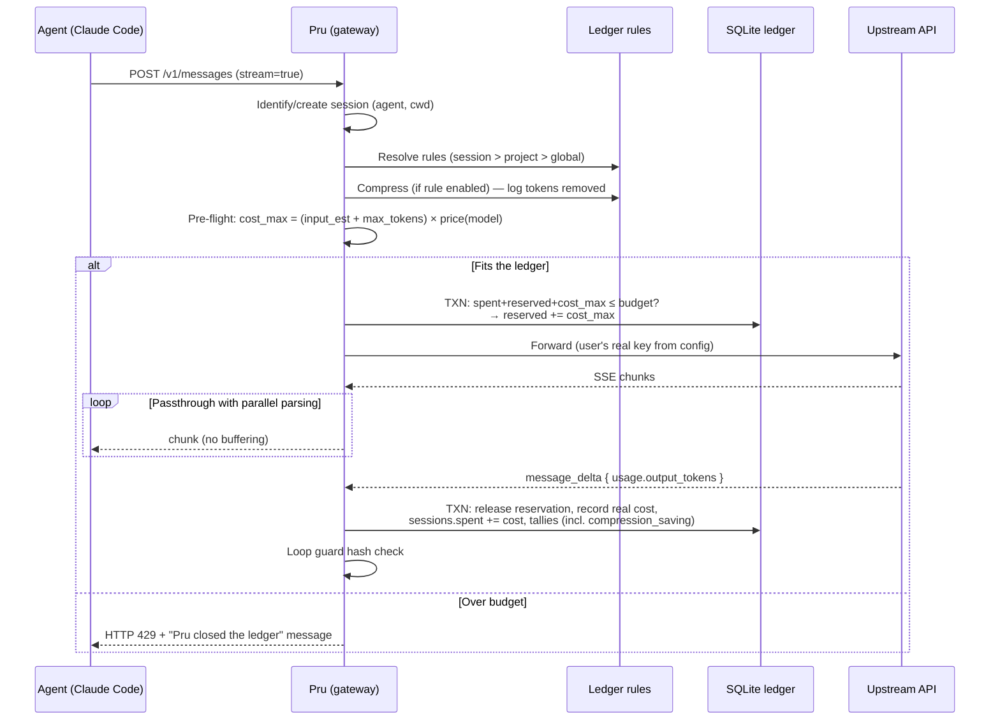
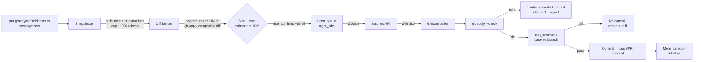
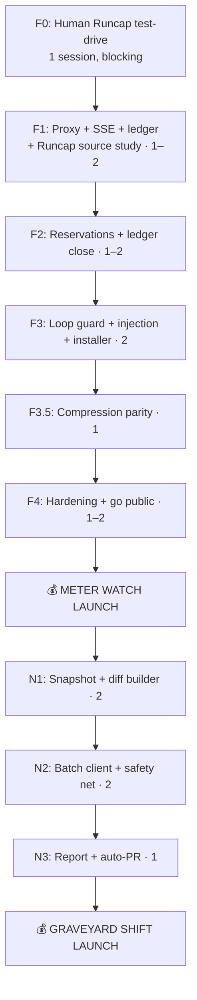

# Prudence — Implementation Plans: The Meter Watch + Graveyard Shift

> **Brand:** **Prudence** ("Pru") — the meticulous bookkeeper who watches what
> your AI agents spend. Binary: `pru`. Voice: precise, calm, slightly stern,
> never cute during errors.
>
> **Positioning (locked 2026-09-11 after competitive sweep, twice):**
> Pru is not "a budget firewall" and not "a task scheduler" — both have
> incumbents (§0). Pru is the **cost-optimization layer for AI agents**:
> hard enforcement when you're awake, half-price batch execution when you
> sleep, and a ledger that proves the savings. Marketing line:
> *"Pru cuts your agent bill — enforcement when awake, Graveyard Shift at half
> price when asleep."* Enforcement is plumbing; **savings is the pitch.**
>
> **Verified assets (claimed 2026-09-11):**
> - npm: `prudence-cli@0.0.1` (placeholder published), alias `pru-cli@0.0.1`
> - GitHub: org `prudence-cli`, repo `prudence-cli/prudence` (**private until F4 launch**)
> - Domain: `prudence.sh` — deferred until F1 passes (buy on first fixture
>   replay success; do NOT print this URL publicly before owned)
> - npm scope `@pru` is taken (dormant squatter); bare `prudence`/`pru` npm
>   names squatted by unrelated projects — distribution is curl + brew + named package
>
> **Execution context:** Built **by a coding agent** with a human directing.
> Work is estimated in **focused build sessions** (~1–3h each, verifiable via
> acceptance criteria). Total MVP: roughly **13–17 sessions**.
>
> Both products share one substrate: a **local gateway** daemon that
> intercepts calls from Claude Code / Codex / OpenRouter via
> `ANTHROPIC_BASE_URL` / `OPENAI_BASE_URL`.

## Product naming map

| Internal concept | Public name |
|---|---|
| Budget firewall (Product 1) | **The Meter Watch** |
| Night batch execution (Product 2) | **Graveyard Shift** |
| Kill-switch trigger | "Pru closed the ledger" |
| Savings meter | "Tallies" / "what Pru saved you" |
| Loop-guard alert | "Circular spending" notice |
| Rules config | The ledger rules |

---

## §0. Competitive landscape (researched 2026-09-11, deep-dived 2026-09-11)

**Do not build blind. These are the incumbents; features below them are
parity obligations or differentiation mandates, not inventions.**

### §0.1 Runcap — the primary threat (read carefully)

Repo: `github.com/kirder24-code/ai-agent-manager` · npm: `runcap`
· free, MIT, single-maintainer, self-described as "early and probably rough".

**Runcap ships TODAY:**

| Capability | Details | Maps to Pru |
|---|---|---|
| Local gateway | `npm install -g runcap`; point agent base URL at its proxy | Meter Watch substrate |
| Hard caps in request path | Returns 429 *before* forwarding when a route would exceed the cap; `AIM_DAILY_BUDGET_USD=5 runcap gateway` env-var config; per-route budgets | §2 core |
| Pre-flight estimation | Cost estimate BEFORE a run starts (the author's original motivation) | §1.4 step 4 |
| **Token compression** | Compresses logs/JSON/stack traces in routed calls before forwarding — a *savings* feature, not just enforcement | ⚠️ Not in our plan. See §0.3 |
| **Proof Gate** | Pinned GitHub Action that replays base-pinned verification of AI-generated PRs; adjudicator executes from an immutable pinned commit so the PR under test cannot rewrite its own referee; branch protections + auto-merge + rollback documented | ⚠️ Overlaps Graveyard Shift's `safety_net` concept |
| Rescue prompt | Detects stuck agents, offers rescue-path prompt | Not in our plan |
| Cost attribution | Cost attributed to named routes for triage | `requests` table + `pru stats` |
| Docs evidence | Evidence trails for review/audit | Tallies // the Ledger |

**Runcap reading:** the maintainer thinks in estimate→cap→compress→verify
and is clearly walking toward automation/async territory (Proof Gate is the
bridge). Assume they could ship batch-style deferred execution. Our surviving
moats are in §0.3.

### §0.2 The rest of the field

| Competitor | What it does | What it doesn't | Pru's stance |
|---|---|---|---|
| **AgentKavach** (indie) | Wraps SDK clients (OpenAI/Anthropic/Google/Mistral), real-time spend tracking, stops agent at budget; kill-switch + saved-modes + MCP-mode interception roadmap | DX = library wrapper you add to code, not an agent-agnostic local daemon; not focused on coding-agent CLIs | Watch it; Pru's zero-code-injection model (env-var proxy) is the better DX for Claude Code users |
| **LiteLLM / Portkey / Bifrost** | Budgets per virtual key, usage-based rate limits, model fallbacks, caching | No session-level caps *during* an agent run; billing-period only; heavy infra (Redis, Helm) | Pru = agent-session granularity, 60-second local install |
| **Kong AI Gateway** | Token-level rate limiting, per-provider dashboards | Enterprise platform | Ignore — different buyer |
| **ccusage / Usage Monitor** (4.8k–16.5k★) | Read-only monitoring from local JSONL | Zero enforcement | "ccusage tells you what you spent. Pru stops it — and makes it cheaper." |
| **`--max-budget-usd`** (native) | Single-command cap in `claude -p` | Not interactive; no loops; no other agents | Pru covers interactive sessions + all agents |
| **Tetrate token brokering** | Enforced budgets + cheaper-model fallback | Enterprise | Steal the idea: `on_exceed: fallback_to_model` as a future rule kind |
| **Anthropic Routines / `/schedule` / Cowork** | Cloud-scheduled agent tasks even with laptop asleep; repo clone; GitHub triggers | Full price; Anthropic-only; lock-in | "Their night shift bills retail; Pru's bills wholesale." |
| **Dreamer plugin** (claudeonrails.dev) | Cron/NL-scheduled Claude Code jobs; worktrees; auto branch/commit/push; usage report | Full price; Rails-flavored | Pru wins on savings math + any repo/agent |

### §0.3 The defensible lane (updated after Runcap deep-dive)

Still open after full read of the field:

1. **Batch-priced overnight execution** (Batches API 50%) — untouched everywhere.
2. **Tallies / savings habit loop** — everyone else *prevents* spend; nobody
   quantifies and celebrates avoided spend as the product itself.
3. **Multi-upstream arbitrage** — route to cheapest-at-moment provider
   (OpenRouter spread), incl. budget-exceed model fallback (per Tetrate).
4. **Productization**: named brand, paid Pro/Team tiers, savings dashboard —
   Runcap is free-MIT hobbyism; nobody is building the company.

**New mandate forced by Runcap's compression:** add *compression* to the
parity list. If their gateway strips stack traces from prompts and Pru's
doesn't, we lose the savings story we need to own. → See F3.5 below.

**Standing rule for all contributors and agents:** before adding any feature,
check this §0. If a competitor shipped it since 2026-09-11, log the
re-decision (parity / skip / differentiate) in PROGRESS.md.

---

## Index

1. Shared architecture (the local gateway)
2. Product 1: The Meter Watch (budget firewall)
3. Product 2: Graveyard Shift (night batch)
4. Unified CLI and UX
5. Technical risks and mitigations
6. Build order and dependency graph
7. Success metrics

---

## 1. Shared architecture: the local gateway

### 1.1 System diagram



### 1.2 Tech stack

| Layer | Choice | Rationale |
|---|---|---|
| Language | TypeScript on Bun | Native fast SSE; single binary via `bun build --compile`; same lang as Runcap (direct study convenience) |
| HTTP server | Hono | Lightweight, first-class streaming |
| DB | SQLite via `better-sqlite3` | Zero deps; **transactional reservations** |
| Config | YAML at `~/.prudence/config.yaml` | Hand-editable |
| Install (primary) | `curl -fsSL prudence.sh/install.sh \| sh` → daemon + writes `env.ANTHROPIC_BASE_URL` into `~/.claude/settings.json` | One command |
| Install (secondary) | `npm i -g prudence-cli` / `brew install prudence-cli/tap/pru` | Already claimed / possible |
| Daemon | `launchd` (macOS) / systemd user unit; fallback `pru start` | No root |
| Repo | `github.com/prudence-cli/prudence` — private until F4, then public + license (MIT vs BSL) | Trust story for a traffic proxy |
| Tests | Fixture-based: recorded agent traffic replayed + mock upstream | No live keys in CI |

### 1.3 Ledger schema (SQLite)

(Unchanged from prior spec — sessions, requests, ledger_rules, night_jobs,
tallies. Full DDL retained.)

```sql
CREATE TABLE sessions (
  id            TEXT PRIMARY KEY,
  agent         TEXT NOT NULL,
  started_at    INTEGER NOT NULL,
  ended_at      INTEGER,
  project_path  TEXT,
  budget_usd    REAL,
  spent_usd     REAL NOT NULL DEFAULT 0,
  reserved_usd  REAL NOT NULL DEFAULT 0,
  status        TEXT NOT NULL DEFAULT 'active'
);

CREATE TABLE requests (
  id              TEXT PRIMARY KEY,
  session_id      TEXT NOT NULL REFERENCES sessions(id),
  upstream        TEXT NOT NULL,
  model           TEXT NOT NULL,
  input_tokens    INTEGER,
  output_tokens   INTEGER,
  cached_tokens   INTEGER DEFAULT 0,
  input_tokens_compressed_out INTEGER,    -- NEW (§0.3): tokens removed by compression
  cost_usd        REAL,
  reserved_usd    REAL,
  status          TEXT NOT NULL,
  req_hash        TEXT,
  created_at      INTEGER NOT NULL,
  completed_at    INTEGER
);
CREATE INDEX idx_requests_session ON requests(session_id, created_at);

CREATE TABLE ledger_rules (
  id          INTEGER PRIMARY KEY AUTOINCREMENT,
  scope       TEXT NOT NULL,
  scope_key   TEXT,
  kind        TEXT NOT NULL,
  config      TEXT NOT NULL,
  enabled     INTEGER NOT NULL DEFAULT 1
);

CREATE TABLE night_jobs (
  id            TEXT PRIMARY KEY,
  project_path  TEXT NOT NULL,
  repo_snapshot TEXT NOT NULL,
  task_prompt   TEXT NOT NULL,
  model         TEXT NOT NULL,
  upstream      TEXT NOT NULL DEFAULT 'anthropic-batch',
  status        TEXT NOT NULL DEFAULT 'queued',
  batch_id      TEXT,
  result_pr_url TEXT,
  est_cost_usd  REAL,
  real_cost_usd REAL,
  queued_at     INTEGER NOT NULL,
  finished_at   INTEGER
);

CREATE TABLE tallies (
  id          INTEGER PRIMARY KEY AUTOINCREMENT,
  kind        TEXT NOT NULL,               -- 'night_discount' | 'loop_blocked' | 'compression_saving' | 'cache_hit'
  amount_usd  REAL NOT NULL,
  detail      TEXT,
  created_at  INTEGER NOT NULL
);
```

### 1.4 Request pipeline



### 1.5 Agent injection

- **Claude Code**: `~/.claude/settings.json` →
  `{ "env": { "ANTHROPIC_BASE_URL": "http://localhost:8787" } }`
- **Codex / OpenAI-compatible**: `OPENAI_BASE_URL=http://localhost:8787/v1`
  via shell rc or `pru run codex …`.
- **Universal**: `pru shell` — subshell with vars injected.

> ⚠️ Known edge case: some internal Claude Code routes reportedly ignore
> `ANTHROPIC_BASE_URL`. Mitigation: recorded-traffic fixtures per agent in CI
> + honest coverage docs. **Runcap's MIT source is the first place to check
> how they solved this.**

---

## 2. Product 1: The Meter Watch (budget firewall)

> Positioning (§0): Runcap parity required on caps + estimation + compression.
> Differentiate on: loop-guard UX, multi-upstream, tallies, and the bundle.
> Parity alone does not ship.

### 2.1 MVP feature set

1. Per-session budget: `pru budget set 5` (USD)
2. Ledger close (kill-switch) on exhaustion
3. Rate limit: max USD/min
4. Loop guard ("circular spending") on repeated identical calls
5. Per-project budgets (`scope='project'`)
6. **Compression pass** (see §2.6/F3.5) — tallies recorded per call
7. `pru status` / `pru stats` / `pru tallies`

### 2.2 Rules data model

```yaml
# ~/.prudence/config.yaml
upstreams:
  anthropic:
    base_url: https://api.anthropic.com
    api_key:  sk-ant-...
  openrouter:
    base_url: https://openrouter.ai/api/v1
    api_key:  sk-or-...

pricing:
  claude-sonnet-4-5:   { input: 3.00, output: 15.00, cached_input: 0.30 }
  claude-haiku:        { input: 0.80, output: 4.00 }

rules:
  - kind: budget
    scope: session
    config: { limit_usd: 5.00, on_exceed: halt }
  - kind: rate_limit
    scope: global
    config: { max_usd_per_minute: 1.00 }
  - kind: loop_guard
    scope: global
    config: { window: 3, action: alert }
  - kind: compression            # parity vs Runcap (§0.3)
    scope: global
    config: { strip: [logs, repeated_json, stack_traces], min_save_tokens: 200 }
```

### 2.3 Streaming cost accuracy

- **Pessimistic reservation at dispatch**: `input_est + max_tokens` at model
  rates → never overshoot.
- **Reconcile on `message_delta` final `usage`**.
- **Aborted streams** (Ctrl+C): estimate from accumulated deltas; mark
  `aborted`.

### 2.4 Ledger close (kill-switch voice)

```text
HTTP 429 + agent-compatible error body:

Pru closed the ledger for this session ($5.00 spent).
Resume with: `pru budget set 10` — or relax the watch: `pru budget off`.
```

### 2.5 Loop guard

- `req_hash = sha1(model + normalized messages)`; window default 3.
- `alert`: inject stream notice ("Pru noticed circular spending…").
- On interrupt → `tallies(kind='loop_blocked')`.

### 2.6 Build phases

| Phase | Scope | Est. sessions | Acceptance criteria |
|---|---|---|---|
| **F0** | Human test-drives **Runcap** + (optionally) AgentKavach; documents caps/compression/OpenRouter/UX gaps in PROGRESS.md | 1 (human) | Written gap list in PROGRESS.md titled "Runcap gap analysis" — this gates F1 |
| F1 | Passthrough proxy + SSE + ledger DB. **Includes "Runcap source study"**: clone their MIT repo; extract their solutions for base-URL interception, estimation, session detection; note license attribution | 1–2 | Replay fixture: every request lands in `requests` w/ real token counts |
| F2 | Reservations + reconciliation + ledger close + pricing + `pru budget/status` | 1–2 | Mock upstream, budget $0.10 → 429 halt; `spent ≤ budget + 1 reservation` |
| F3 | Loop guard, rate limit, agent injection, `pru shell`, installer | 2 | Fresh checkout → proxied with zero manual config |
| **F3.5** | **Compression pass** (strip logs/stack traces/repeated JSON from routed prompts; record savings in tallies) | 1 | Fixture with a 20k-token log-heavy prompt → measurable token reduction logged; passthrough integrity tests green (no semantic damage provable via mock that echoes) |
| F4 | Hardening: aborts, fixtures per agent, README, landing, **repo public + LICENSE** | 1–2 | Ctrl+C mid-stream → consistent DB |
| **F5** | **Public launch** — headline leads with savings | — | — |

### 2.7 Monetization

- **Free**: basic limits, 1 upstream, compression
- **Pro (~$6/mo)**: multi-upstream, per-project budgets, history, tallies,
  advanced rules
- **Team (~$15/seat)**: hosted engine, team budgets, dashboard, Slack alerts

---

## 3. Product 2: Graveyard Shift (night batch)

> Positioning (§0): scheduling is owned (Routines, Dreamer). This product
> exists ONLY as batch-priced execution. Every piece must surface the 50%
> math. Verification tooling (Proof-Gate-like) belongs here as `safety_net`.

### 3.1 Concept

User marks non-urgent tasks → Pru runs them ~2am against the **Anthropic
Message Batches API (50% off, 24h SLA)** → morning deliverable: branch/PR +
summary + savings tally.

### 3.2 MVP: one-shot tasks



### 3.3–3.5 Components, config, phase 2

| Component | Spec |
|---|---|
| `snapshotter` | `git bundle create` + file selection heuristics; context cap |
| `diff_builder` | Unified diff forced; `git apply --check` pre-repo-touch |
| `batch_client` | `night_jobs` queue → 2am submit → 6am poll |
| `safety_net` | Pre: apply --check. Post: `graveyard.test_command` on base AND night branch; compare |
| `notifier` | `pru graveyard report` + optional Slack/Discord webhook |

```yaml
graveyard:
  window: { start: "02:00", end: "06:00", timezone: local }
  prefer: anthropic-batch          # 50% off — the reason this product exists
  fallback: openrouter-cheapest
  test_command: "npm test --silent"
  auto_pr: false
```

Phase 2 (post-MVP): headless night agents in ephemeral containers;
cheapest-at-moment OpenRouter selection; key capped + repo read-only;
prepaid credits (margin over the 50% batch discount).

### 3.6 Build phases

| Phase | Scope | Est. sessions | Acceptance criteria |
|---|---|---|---|
| N1 | Snapshotter + diff builder + `pru graveyard` w/ 50%-priced estimate | 2 | Real repo → valid batch payload; dry-run |
| N2 | Batch client state machine + diff application + safety net | 2 | Mock batch fixture → branch, tests compared, report |
| N3 | Morning report + tally math + auto-PR + dogfood | 1 | E2E: one overnight task lands as PR unassisted |
| N4 | Launch as Pro feature — headline: median $ saved/night | — | — |

---

## 4. Unified CLI

```bash
pru install
pru start | stop | status
pru budget set 5
pru budget project 20
pru pricing update
pru stats
pru tallies
pru graveyard "task…"
pru graveyard list | report
pru shell -- codex
```

---

## 5. Technical risks and mitigations

| Risk | Likelihood | Mitigation |
|---|---|---|
| `ANTHROPIC_BASE_URL` misses routes | Medium | Fixtures; **study Runcap source first (F1)** |
| Aborted-stream estimation | High | Chunk-accumulated estimate, flagged |
| **Compression corrupts prompts** (semantic damage) | Medium | Conservative strip list; unit tests w/ echo-mock; `min_save_tokens` threshold; per-rule off-switch |
| Night diff fails apply | High | 1 retry w/ conflict; else `.diff` artifact |
| Proxy distrust | High | Public at F4; local-first; opt-in telemetry only |
| Keys in config | Medium | chmod 600; OS keychain follow-up |
| **Runcap ships batch-pricing first** | Medium | §0 standing rule; tallies+graveyard economics ship early (do NOT defer N-track indefinitely) |
| **Anthropic ships batch-priced scheduling natively** | Medium | Reposition to multi-vendor arbitrage — they can't offer OpenRouter spread neutrally |

---

## 6. Build order



---

## 7. Success metrics

**Meter Watch:** >60% activation · ledger closes/week · D7 >30% ·
compression savings median ≥10% of input tokens (parity bar)

**Graveyard Shift:** >50% unassisted diffs · median $ saved/night (publish it)

**Business:** 3–5% free→Pro · tallies aggregate as social proof

---

## Brand kit

- **Product**: Prudence · **binary**: `pru`
- **npm**: `prudence-cli`, `pru-cli` (both claimed 2026-09-11)
- **Repo**: `github.com/prudence-cli/prudence` (private until F4)
- **Install**: `curl -fsSL prudence.sh/install.sh | sh` (register domain at F1 pass)
- **Positioning**: *"Pru cuts your agent bill — enforcement when awake, half price when asleep."*
- **Voice**: calm, precise bookkeeper. Canonical strings unchanged.
- **Features**: Meter Watch · Graveyard Shift · Tallies · the Ledger
