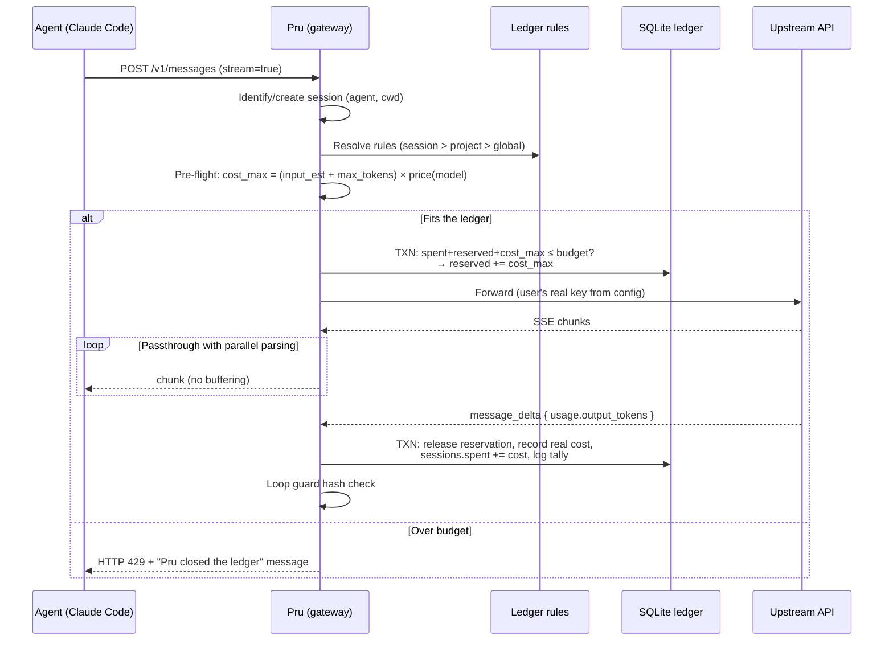
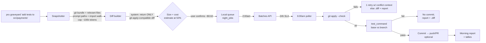
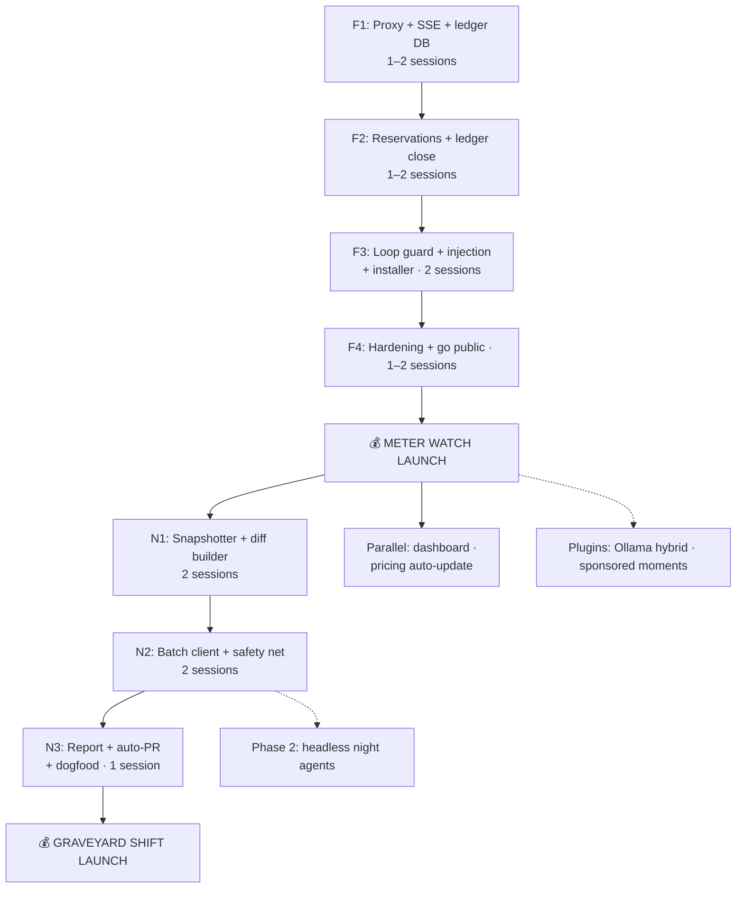

# Prudence — Implementation Plans: The Meter Watch + Graveyard Shift

> **Brand:** **Prudence** ("Pru") — the meticulous bookkeeper who watches what
> your AI agents spend. Binary: `pru`. Voice: precise, calm, slightly stern,
> never cute during errors.
>
> **Verified assets (claimed 2026-09-11):**
> - npm: `prudence-cli@0.0.1` (placeholder published), alias `pru-cli@0.0.1`
> - GitHub: org `prudence-cli`, repo `prudence-cli/prudence` (**private until F4 launch**)
> - Domain: `prudence.sh` (register before printing anywhere)
> - npm scope `@pru` is taken (dormant squatter); bare `prudence`/`pru` npm
>   names squatted by unrelated projects — distribution is curl + brew + named package
>
> **Execution context:** Built **by a coding agent** with a human directing.
> Work is estimated in **focused build sessions** (~1–3h each, verifiable via
> acceptance criteria). Total MVP: roughly **12–16 sessions** — days, not
> months.
>
> Both products share one substrate: a **local gateway** daemon that
> intercepts calls from Claude Code / Codex / OpenRouter via
> `ANTHROPIC_BASE_URL` / `OPENAI_BASE_URL`.

## Product naming map

| Internal concept | Public name |
|---|---|
| Budget firewall (Product 1) | **The Meter Watch** |
| Night batch execution (Product 2) | **Graveyard Shift** |
| Kill-switch trigger | "Pru closed the ledger" |
| Savings meter | "Tallies" / "what Pru saved you" |
| Loop-guard alert | "Circular spending" notice |
| Rules config | The ledger rules |

---

## Index

1. Shared architecture (the local gateway)
2. Product 1: The Meter Watch (budget firewall)
3. Product 2: Graveyard Shift (night batch)
4. Unified CLI and UX
5. Technical risks and mitigations
6. Build order and dependency graph
7. Success metrics

---

## 1. Shared architecture: the local gateway

### 1.1 System diagram


### 1.2 Tech stack

| Layer | Choice | Rationale |
|---|---|---|
| Language | TypeScript on Bun | Native fast SSE; single binary via `bun build --compile` |
| HTTP server | Hono | Lightweight, first-class streaming |
| DB | SQLite via `better-sqlite3` | Zero deps; **transactional reservations** |
| Config | YAML at `~/.prudence/config.yaml` | Hand-editable |
| Install (primary) | `curl -fsSL prudence.sh/install.sh \| sh` → daemon + writes `env.ANTHROPIC_BASE_URL` into `~/.claude/settings.json` | One command |
| Install (secondary) | `npm i -g prudence-cli` / `brew install prudence-cli/tap/pru` | npm name + brew tap already claimed/possible |
| Daemon | `launchd` (macOS) / systemd user unit; fallback `pru start` | No root |
| Repo | `github.com/prudence-cli/prudence` — private until F4, then public + license decision (MIT vs BSL) | Trust story for a traffic proxy |
| Tests | Fixture-based: recorded agent traffic replayed through the proxy + mock upstream | No live keys in CI |

### 1.3 Ledger schema (SQLite)

```sql
CREATE TABLE sessions (
  id            TEXT PRIMARY KEY,
  agent         TEXT NOT NULL,             -- 'claude-code' | 'codex' | ...
  started_at    INTEGER NOT NULL,
  ended_at      INTEGER,
  project_path  TEXT,
  budget_usd    REAL,                      -- NULL = unlimited
  spent_usd     REAL NOT NULL DEFAULT 0,
  reserved_usd  REAL NOT NULL DEFAULT 0,
  status        TEXT NOT NULL DEFAULT 'active'
);

CREATE TABLE requests (
  id              TEXT PRIMARY KEY,
  session_id      TEXT NOT NULL REFERENCES sessions(id),
  upstream        TEXT NOT NULL,
  model           TEXT NOT NULL,
  input_tokens    INTEGER,
  output_tokens   INTEGER,
  cached_tokens   INTEGER DEFAULT 0,
  cost_usd        REAL,
  reserved_usd    REAL,
  status          TEXT NOT NULL,           -- in_flight | done | aborted | deferred | failed
  req_hash        TEXT,
  created_at      INTEGER NOT NULL,
  completed_at    INTEGER
);
CREATE INDEX idx_requests_session ON requests(session_id, created_at);

CREATE TABLE ledger_rules (
  id          INTEGER PRIMARY KEY AUTOINCREMENT,
  scope       TEXT NOT NULL,               -- 'global' | 'project' | 'session'
  scope_key   TEXT,
  kind        TEXT NOT NULL,               -- 'budget' | 'rate_limit' | 'loop_guard' | 'night_window'
  config      TEXT NOT NULL,               -- JSON
  enabled     INTEGER NOT NULL DEFAULT 1
);

-- Graveyard Shift jobs
CREATE TABLE night_jobs (
  id            TEXT PRIMARY KEY,
  project_path  TEXT NOT NULL,
  repo_snapshot TEXT NOT NULL,
  task_prompt   TEXT NOT NULL,
  model         TEXT NOT NULL,
  upstream      TEXT NOT NULL DEFAULT 'anthropic-batch',
  status        TEXT NOT NULL DEFAULT 'queued',
  batch_id      TEXT,
  result_pr_url TEXT,
  est_cost_usd  REAL,
  real_cost_usd REAL,
  queued_at     INTEGER NOT NULL,
  finished_at   INTEGER
);

CREATE TABLE tallies (
  id          INTEGER PRIMARY KEY AUTOINCREMENT,
  kind        TEXT NOT NULL,               -- 'night_discount' | 'loop_blocked' | 'cache_hit'
  amount_usd  REAL NOT NULL,
  detail      TEXT,
  created_at  INTEGER NOT NULL
);
```

### 1.4 Request pipeline



**Implementation steps:**

1. Receive `POST /v1/messages`.
2. **Session inference**: time window + cwd signal, or new session.
3. **Rule resolution**: session → project → global (most specific wins).
4. **Pre-flight**: pessimistic estimate using the request's own `max_tokens`.
5. **Atomic reservation** in one SQLite transaction — else refuse (§2.4).
6. **Forward upstream**, replacing auth with user keys from `config.yaml`.
7. **Streaming passthrough**: forward unbuffered; parse in parallel. Final
   `message_delta` carries real `usage.output_tokens`.
8. **Reconcile** transactionally: release reservation, real cost, session
   spend, tally.
9. **Loop guard**: `sha1(model + normalized messages)`; 3 identical
   consecutive hashes → alert/pause.

### 1.5 Agent injection

- **Claude Code**: `~/.claude/settings.json` →
  ```json
  { "env": { "ANTHROPIC_BASE_URL": "http://localhost:8787" } }
  ```
- **Codex / OpenAI-compatible**: `OPENAI_BASE_URL=http://localhost:8787/v1`
  via shell rc or `pru run codex …`.
- **Universal**: `pru shell` — subshell with vars injected.

> ⚠️ Known edge case: some internal Claude Code routes reportedly ignore
> `ANTHROPIC_BASE_URL`. Mitigation: recorded-traffic fixtures per agent in CI
> + honest coverage docs.

---

## 2. Product 1: The Meter Watch (budget firewall)

### 2.1 MVP feature set

1. Per-session budget: `pru budget set 5` (USD)
2. Ledger close (kill-switch) on exhaustion
3. Rate limit: max USD/min
4. Loop guard ("circular spending") on repeated identical calls
5. Per-project budgets (`ledger_rules` with `scope='project'`)
6. `pru status`: today, current session, month projection

### 2.2 Rules data model

```yaml
# ~/.prudence/config.yaml
upstreams:
  anthropic:
    base_url: https://api.anthropic.com
    api_key:  sk-ant-...
  openrouter:
    base_url: https://openrouter.ai/api/v1
    api_key:  sk-or-...

pricing:            # refreshed via `pru pricing update`
  claude-sonnet-4-5:   { input: 3.00, output: 15.00, cached_input: 0.30 }
  claude-haiku:        { input: 0.80, output: 4.00 }

rules:
  - kind: budget
    scope: session
    config: { limit_usd: 5.00, on_exceed: halt }
  - kind: rate_limit
    scope: global
    config: { max_usd_per_minute: 1.00 }
  - kind: loop_guard
    scope: global
    config: { window: 3, action: alert }
```

### 2.3 Streaming cost accuracy

- **Pessimistic reservation at dispatch**: `input_est + max_tokens` at model
  rates → real spend can never overshoot.
- **Reconcile on final event**: `message_delta` `usage`.
- **Aborted streams** (Ctrl+C): estimate from accumulated deltas
  (~3.5 chars/token); mark `status='aborted'` with estimation note.

### 2.4 Ledger close (kill-switch voice)

```text
HTTP 429 + agent-compatible error body:

Pru closed the ledger for this session ($5.00 spent).
Resume with: `pru budget set 10` — or relax the watch: `pru budget off`.
```

Must be **recoverable**: 429 + clear message → agent surfaces it and waits,
state intact.

### 2.5 Loop guard

- Normalize messages → `req_hash`; window default 3.
- `alert`: request proceeds; notice injected into stream:
  "Pru noticed circular spending: the same call 3× ($0.43 on this streak) —
  Ctrl+C to interrupt?"
- On interrupt → `tallies(kind='loop_blocked')`.

### 2.6 Build phases

| Phase | Scope | Est. sessions | Acceptance criteria |
|---|---|---|---|
| F1 | Passthrough proxy + SSE parse + SQLite logging | 1–2 | Replay fixture: every request lands in `requests` with real token counts |
| F2 | Reservations + reconciliation + ledger close + pricing + `pru budget/status` | 1–2 | Mock upstream, budget $0.10 → halts with 429; `spent ≤ budget + 1 reservation`; tests green |
| F3 | Loop guard, rate limit, agent auto-injection, `pru shell`, install script | 2 | Fresh checkout: installer → `claude` proxied with zero manual config |
| F4 | Hardening: aborts, fixtures per agent, README, landing, **repo goes public, license chosen** | 1–2 | Ctrl+C mid-stream → consistent DB, no zombie reservations |
| **F5** | **Public launch** | — | — |

### 2.7 Monetization

- **Free**: basic limits, 1 upstream
- **Pro (~$6/mo)**: multi-upstream, per-project budgets, history, tallies,
  advanced rules
- **Team (~$15/seat)**: hosted engine, team budgets, dashboard, Slack alerts,
  audit trail

---

## 3. Product 2: Graveyard Shift (night batch)

### 3.1 Concept

User marks non-urgent tasks → Pru executes them ~2am against the **Anthropic
Message Batches API (50% off, 24h SLA)** → morning deliverable: branch/PR +
summary + tally of what was saved.

### 3.2 MVP: one-shot tasks

Batches API = single request/response. MVP scope: tests, refactors,
docstrings, migrations.



### 3.3 Components

| Component | Spec |
|---|---|
| `snapshotter` | `git bundle create` + file selection heuristics; context cap |
| `diff_builder` | Prompt template forcing unified diff; validate via `git apply --check` before touching repo |
| `batch_client` | `night_jobs` queue → 2am submit → 6am poll; per-request results |
| `safety_net` | Pre: `git apply --check`. Post: run `graveyard.test_command` on base AND night branch; compare |
| `notifier` | `pru graveyard report` + optional Slack/Discord webhook |

### 3.4 Config

```yaml
graveyard:
  window: { start: "02:00", end: "06:00", timezone: local }
  prefer: anthropic-batch
  fallback: openrouter-cheapest
  test_command: "npm test --silent"
  auto_pr: false
```

### 3.5 Phase 2 (post-MVP): headless night agents

- Ephemeral containers running `claude -p` headless against the snapshot
- Dynamic cheapest-upstream selection on OpenRouter
- Security: container holds only an LLM key with spend cap; repo read-only
- Unlocks prepaid credits ($10 of graveyard compute; margin over the 50%)

### 3.6 Build phases

| Phase | Scope | Est. sessions | Acceptance criteria |
|---|---|---|---|
| N1 | Snapshotter + diff builder + `pru graveyard` w/ estimate & confirm | 2 | Real repo → valid batch payload; dry-run mode works |
| N2 | Batch client state machine + diff application + safety net | 2 | Mock batch fixture → branch created, tests compared, report written |
| N3 | Morning report + tally math + auto-PR + dogfood | 1 | E2E on own repo: one overnight task lands as PR unassisted |
| N4 | Launch as Pro feature | — | — |

---

## 4. Unified CLI

```bash
pru install                       # daemon + agent injection
pru start | stop | status
pru budget set 5                  # meter watch: session limit (USD)
pru budget project 20             # per-repo limit
pru pricing update
pru stats                         # spend by day/model/project
pru tallies                       # what Pru saved you
pru graveyard "task…"             # queue overnight work
pru graveyard list | report
pru shell -- codex                # subshell with proxy injected
```

UX principles: zero mandatory config post-install · everything inspectable ·
every tally celebrated in Pru's voice ("Pru set aside $4.90 last night.").

---

## 5. Technical risks and mitigations

| Risk | Likelihood | Mitigation |
|---|---|---|
| `ANTHROPIC_BASE_URL` misses internal routes | Medium | Per-agent fixtures in CI; honest docs |
| Aborted-stream cost estimation | High | Chunk-accumulated estimate, flagged |
| Night diff fails `git apply --check` | High | 1 retry w/ conflict context; else `.diff` + report; never commit garbage |
| Pre-existing test failures → false alarms | Medium | Compare base vs night branch |
| Stale pricing | Medium | `pru pricing update`; versioned per row |
| Proxy distrust | High | Public at F4 launch + local-first + opt-in telemetry only |
| Batch latency > window | Medium | 24h SLA: report handles "still processing" |
| Keys in config | Medium | chmod 600; OS keychain follow-up |
| Naming leftovers | Low | npm: use `prudence-cli` / `pru-cli` (owned); `@pru` scope unavailable (dormant squatter) — never reference it in docs |

---

## 6. Build order and dependency graph



**MVP total: ~12–16 focused sessions.** The Meter Watch justifies the install
and leaves token accounting working; Graveyard Shift rides on that accounting
+ one external dependency (Batches API — the 50% discount is included, zero
compute infrastructure to build).

---

## 7. Success metrics

**Meter Watch:** activation >60% proxied ≥1 session · ledger closes firing per
week (pain validated) · D7 retention >30%

**Graveyard Shift:** >50% diffs applied unassisted · median $ saved/night
(publish it — it IS the pitch) · qualitative: "trust Pru every night?"

**Business:** free → Pro conversion 3–5% · aggregate tallies as social proof

---

## Brand kit (for docs, README, and generated copy)

- **Product**: Prudence · **binary/CLI**: `pru`
- **npm**: `prudence-cli` (primary), `pru-cli` (alias) — both published as v0.0.1 placeholders on 2026-09-11
- **Repo**: `github.com/prudence-cli/prudence` (private until F4)
- **Install**: `curl -fsSL prudence.sh/install.sh | sh`
- **Voice**: first-person bookkeeper. Calm, precise, dry. Sample strings:
  - Budget hit: *"Pru closed the ledger for this session ($5.00 spent)."*
  - Loop guard: *"Pru noticed circular spending: same call 3× ($0.43)."*
  - Morning: *"Graveyard shift complete. 312 tests, $0.61, branch `night/a3f2`.
    Pru set aside $4.90 versus day rates."*
  - Never: emoji in errors, exclamation marks, apologetic tone.
- **Features**: Meter Watch (firewall) · Graveyard Shift (night batch) ·
  Tallies (savings meter) · the Ledger (audit history)
